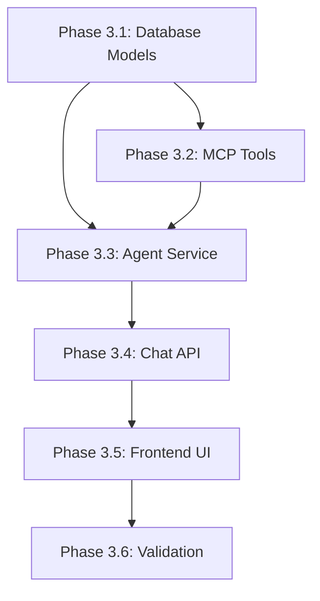

# Implementation Plan: Todo AI Chatbot (Phase-3)

**Branch**: `005-todo-ai-chatbot` | **Date**: 2026-01-02 | **Spec**: [spec.md](./spec.md)
**Input**: Feature specification from `/specs/005-todo-ai-chatbot/spec.md`

## Summary

Implement an AI-powered chat interface that allows users to manage their tasks through natural language conversation. The system uses OpenAI Agents SDK with MCP (Model Context Protocol) tools for task operations, ChatKit for the UI, and maintains full statelessness with PostgreSQL-backed conversation persistence.

## Technical Context

**Language/Version**: Python 3.11 (backend), TypeScript 5 (frontend)
**Primary Dependencies**:
  - Backend: FastAPI >=0.115.0, OpenAI SDK >=1.0.0, MCP SDK >=1.0.0, SQLModel
  - Frontend: Next.js 16, React 19, @chatscope/chat-ui-kit-react
**Storage**: PostgreSQL (existing) + new Conversation/Message tables
**Testing**: pytest (backend), Jest/React Testing Library (frontend)
**Target Platform**: Web application (desktop/mobile browsers)
**Project Type**: Web application with separate frontend/backend
**Performance Goals**: <5s AI response time, 100 concurrent chat sessions
**Constraints**: Stateless server (no in-memory state), JWT authentication required
**Scale/Scope**: Single user conversations, ~1000 messages per user

## Constitution Check

*GATE: Must pass before Phase 0 research. Re-check after Phase 1 design.*

| Principle | Pre-Design Status | Post-Design Status |
|-----------|-------------------|-------------------|
| I. Data Integrity First | ✅ Messages stored atomically | ✅ DB transactions for all writes |
| II. Offline-First | ⚠️ Partial - chat requires network | ⚠️ Queue failed sends on frontend |
| III. User Experience | ✅ <5s target, loading states | ✅ TypingIndicator, error messages |
| IV. TDD | 🔲 Tests required | 🔲 Test plan in tasks.md |
| V. Security & Privacy | ✅ JWT auth, user isolation | ✅ user_id validation on all tools |
| VI. Performance Budget | ✅ Async operations | ✅ Message pagination supported |

**Offline-First Exception**: Chat functionality inherently requires network for AI processing. Constitution allows graceful degradation with clear feedback. Frontend will queue failed message sends and display sync status.

## Project Structure

### Documentation (this feature)

```text
specs/005-todo-ai-chatbot/
├── plan.md              # This file
├── spec.md              # Feature requirements
├── research.md          # Technology decisions
├── data-model.md        # Database schema
├── quickstart.md        # Implementation guide
├── contracts/
│   ├── chat-api.yaml    # OpenAPI specification
│   └── mcp-tools.yaml   # MCP tool definitions
├── checklists/
│   └── requirements.md  # Quality checklist
└── tasks.md             # Generated by /sp.tasks
```

### Source Code (repository root)

```text
backend/
├── app/
│   ├── models/
│   │   ├── task.py          # Existing (add description field)
│   │   ├── conversation.py  # NEW: Conversation model
│   │   └── message.py       # NEW: Message model
│   ├── mcp/
│   │   ├── __init__.py      # NEW: MCP module init
│   │   └── tools.py         # NEW: MCP tool implementations
│   ├── services/
│   │   └── agent.py         # NEW: OpenAI agent service
│   ├── api/routes/
│   │   ├── tasks.py         # Existing
│   │   ├── health.py        # Existing
│   │   └── chat.py          # NEW: Chat endpoints
│   └── schemas/
│       └── chat.py          # NEW: Chat request/response schemas
├── alembic/versions/
│   └── xxx_add_chat.py      # NEW: Migration for conversations/messages
└── tests/
    ├── test_mcp_tools.py    # NEW: MCP tool unit tests
    └── test_chat.py         # NEW: Chat endpoint integration tests

frontend/
├── src/
│   ├── components/
│   │   ├── chat/
│   │   │   ├── chat-container.tsx   # NEW: Main chat wrapper
│   │   │   ├── message-list.tsx     # NEW: Message display
│   │   │   ├── message-input.tsx    # NEW: User input
│   │   │   └── typing-indicator.tsx # NEW: Loading state
│   │   └── tasks/                   # Existing (may deprecate)
│   ├── app/(dashboard)/
│   │   ├── dashboard/page.tsx       # Existing
│   │   └── chat/
│   │       └── page.tsx             # NEW: Chat page
│   ├── hooks/
│   │   └── use-chat.ts              # NEW: Chat hook
│   └── lib/
│       ├── api.ts                   # Existing
│       └── chat-api.ts              # NEW: Chat API client
└── __tests__/
    └── chat/                        # NEW: Chat component tests
```

**Structure Decision**: Web application with existing backend/frontend separation. New modules added to each side for chat functionality.

## Implementation Phases

### Phase 3.1: Backend Database & Models

**Goal**: Add database infrastructure for conversations and messages

**Tasks**:
1. Create `Conversation` SQLModel in `backend/app/models/conversation.py`
2. Create `Message` SQLModel in `backend/app/models/message.py`
3. Add `description` field to existing `Task` model
4. Generate Alembic migration for new tables
5. Run migration and verify schema

**Deliverables**:
- `conversation.py`, `message.py` models
- Alembic migration file
- Updated `Task` model

---

### Phase 3.2: MCP Tools Implementation

**Goal**: Implement stateless MCP tools for task operations

**Tasks**:
1. Create MCP tools module `backend/app/mcp/tools.py`
2. Implement `add_task` tool
3. Implement `list_tasks` tool
4. Implement `complete_task` tool with title matching
5. Implement `update_task` tool
6. Implement `delete_task` tool
7. Write unit tests for each tool

**Deliverables**:
- `tools.py` with 5 MCP tool implementations
- `test_mcp_tools.py` with unit tests

---

### Phase 3.3: OpenAI Agent Service

**Goal**: Implement AI agent with tool calling capability

**Tasks**:
1. Create agent service `backend/app/services/agent.py`
2. Implement OpenAI client initialization
3. Implement conversation context building from message history
4. Implement tool calling loop
5. Implement response generation
6. Add error handling and retries

**Deliverables**:
- `agent.py` with OpenAI integration
- Tool calling loop implementation

---

### Phase 3.4: Chat API Endpoints

**Goal**: Create REST endpoints for chat functionality

**Tasks**:
1. Create chat schemas `backend/app/schemas/chat.py`
2. Create chat routes `backend/app/api/routes/chat.py`
3. Implement `POST /{user_id}/chat` endpoint
4. Implement `GET /{user_id}/chat/history` endpoint
5. Add JWT validation and user_id verification
6. Register routes in main app
7. Write integration tests

**Deliverables**:
- `chat.py` schemas and routes
- Integration tests in `test_chat.py`

---

### Phase 3.5: Frontend Chat UI

**Goal**: Build chat interface using ChatKit

**Tasks**:
1. Install @chatscope/chat-ui-kit-react
2. Create `ChatContainer` component
3. Create `MessageList` component
4. Create `MessageInput` component
5. Create `TypingIndicator` component
6. Create chat API client `lib/chat-api.ts`
7. Create `useChat` hook for state management
8. Create chat page at `/dashboard/chat`
9. Add navigation to chat from dashboard
10. Style components to match existing design

**Deliverables**:
- Chat component suite
- Chat page
- API client and hook

---

### Phase 3.6: Integration & Validation

**Goal**: End-to-end testing and validation

**Tasks**:
1. Write E2E tests for complete chat flow
2. Test conversation persistence across sessions
3. Test tool chaining (multiple tools in one conversation)
4. Verify statelessness (server restart doesn't lose state)
5. Load test with concurrent users
6. Fix any issues discovered

**Deliverables**:
- E2E test suite
- Performance test results
- Bug fixes

## Complexity Tracking

> No constitution violations requiring justification.

| Aspect | Decision | Rationale |
|--------|----------|-----------|
| Single AI provider | OpenAI only | Spec requirement, simplifies implementation |
| Single conversation per user | UNIQUE constraint | Spec assumption, can extend later |
| ChatKit vs custom | ChatKit | Faster development, proven components |

## Dependencies



## Risk Assessment

| Risk | Likelihood | Impact | Mitigation |
|------|------------|--------|------------|
| OpenAI rate limits | Medium | High | Implement retry with backoff, cache responses |
| Slow AI responses | Medium | Medium | Streaming responses, timeout handling |
| Token costs | Low | Medium | Use GPT-4o-mini, limit context window |
| MCP SDK compatibility | Low | Medium | Fall back to custom tool format |

## Success Metrics

From spec:
- SC-001: AI response within 5 seconds ✅ Monitored via logging
- SC-002: 90% task add success rate ✅ Tracked via tool call results
- SC-005: Conversation persistence ✅ Tested in Phase 3.6
- SC-007: 100 concurrent sessions ✅ Load tested in Phase 3.6

## Next Steps

Run `/sp.tasks` to generate the detailed task list with test cases for implementation.
