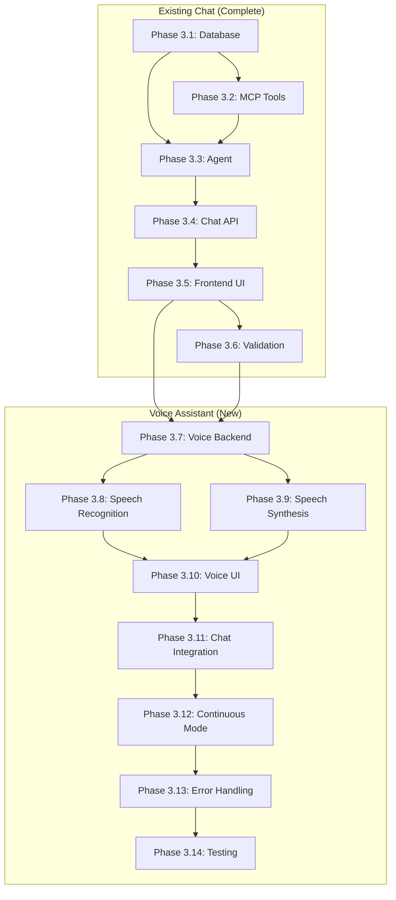

# Implementation Plan: Todo AI Chatbot with Voice Assistant (Phase-3 Enhanced)

**Branch**: `005-todo-ai-chatbot` (enhanced with `001-voice-assistant`) | **Date**: 2026-01-25 | **Spec**: [spec.md](./spec.md)
**Input**: Feature specification from `/specs/005-todo-ai-chatbot/spec.md`

## Summary

Extend the existing AI-powered chat interface with Voice Assistant capabilities. Users can manage tasks through both text and voice commands using the Web Speech API (SpeechRecognition for input, SpeechSynthesis for output). The implementation adds voice input/output controls, continuous conversation mode, and user preference persistence while maintaining the existing ChatKit UI and MCP-based backend.

## Technical Context

**Language/Version**: Python 3.11 (backend), TypeScript 5 (frontend)
**Primary Dependencies**:
  - Backend: FastAPI >=0.115.0, OpenAI SDK >=1.0.0, MCP SDK >=1.0.0, SQLModel
  - Frontend: Next.js 16, React 19, @chatscope/chat-ui-kit-react
  - Voice (NEW): Web Speech API (browser-native SpeechRecognition, SpeechSynthesis)
**Storage**: PostgreSQL (existing) + Conversation/Message tables + UserVoicePreferences table
**Testing**: pytest (backend), Jest/React Testing Library (frontend), manual voice testing
**Target Platform**: Web application (desktop/mobile browsers with Web Speech API support)
**Project Type**: Web application with separate frontend/backend
**Performance Goals**: <5s AI response time, <3s voice transcription, <2s TTS start, 100 concurrent sessions
**Constraints**: Stateless server, JWT auth, Web Speech API browser support required for voice
**Scale/Scope**: Single user conversations, ~1000 messages per user, voice preferences per user

### Voice-Specific Technical Decisions

| Decision | Choice | Rationale |
|----------|--------|-----------|
| Speech Recognition | Web Speech API (SpeechRecognition) | Browser-native, no external API costs, good accuracy |
| Text-to-Speech | Web Speech API (SpeechSynthesis) | Browser-native, user-selectable system voices |
| Continuous Mode Activation | Button-only (no wake word) | Simpler, no privacy concerns, reliable |
| Silence Timeout | 5 seconds | Balanced user experience |
| Voice Preference Storage | PostgreSQL UserVoicePreferences | Persist across sessions, server-side storage |

## Constitution Check

*GATE: Must pass before Phase 0 research. Re-check after Phase 1 design.*

| Principle | Pre-Design Status | Post-Design Status |
|-----------|-------------------|-------------------|
| I. Data Integrity First | ✅ Messages stored atomically, voice prefs persisted | ✅ DB transactions for all writes |
| II. Offline-First | ⚠️ Partial - chat/voice requires network | ⚠️ Graceful degradation to text-only |
| III. User Experience | ✅ <5s response, <3s voice transcription | ✅ Visual/audio feedback for all states |
| IV. TDD | 🔲 Tests required | 🔲 Test plan in tasks.md |
| V. Security & Privacy | ✅ JWT auth, user isolation, no always-on mic | ✅ Button-only voice activation |
| VI. Performance Budget | ✅ Browser-native APIs, no external TTS cost | ✅ Client-side voice processing |

**Offline-First Exception**: Chat and voice functionality inherently requires network for AI processing. Constitution allows graceful degradation with clear feedback. Voice features fall back to text-only mode when browser support unavailable.

**Privacy Note**: Voice input uses button-only activation (no wake word). Microphone is only active when user explicitly presses the button. No audio is stored or transmitted - only transcribed text is sent to server.

## Project Structure

### Documentation (this feature)

```text
specs/005-todo-ai-chatbot/
├── plan.md              # This file
├── spec.md              # Feature requirements
├── research.md          # Technology decisions
├── data-model.md        # Database schema
├── quickstart.md        # Implementation guide
├── contracts/
│   ├── chat-api.yaml    # OpenAPI specification
│   └── mcp-tools.yaml   # MCP tool definitions
├── checklists/
│   └── requirements.md  # Quality checklist
└── tasks.md             # Generated by /sp.tasks
```

### Source Code (repository root)

```text
backend/
├── app/
│   ├── models/
│   │   ├── task.py              # Existing
│   │   ├── conversation.py      # Existing: Conversation model
│   │   ├── message.py           # MODIFY: Add input_method field
│   │   └── voice_preferences.py # NEW: UserVoicePreferences model
│   ├── mcp/
│   │   ├── __init__.py          # Existing: MCP module init
│   │   └── tools.py             # Existing: MCP tool implementations
│   ├── services/
│   │   └── agent.py             # Existing: OpenAI agent service
│   ├── api/routes/
│   │   ├── tasks.py             # Existing
│   │   ├── health.py            # Existing
│   │   ├── chat.py              # Existing: Chat endpoints
│   │   └── voice.py             # NEW: Voice preferences endpoints
│   └── schemas/
│       ├── chat.py              # MODIFY: Add input_method to request
│       └── voice.py             # NEW: Voice preferences schemas
├── alembic/versions/
│   └── xxx_add_voice.py         # NEW: Migration for voice preferences
└── tests/
    ├── test_mcp_tools.py        # Existing
    ├── test_chat.py             # Existing
    └── test_voice.py            # NEW: Voice preferences tests

frontend/
├── src/
│   ├── components/
│   │   ├── chat/
│   │   │   ├── chat-container.tsx    # MODIFY: Add voice controls
│   │   │   ├── message-list.tsx      # Existing
│   │   │   ├── message-input.tsx     # MODIFY: Add mic button
│   │   │   ├── typing-indicator.tsx  # Existing
│   │   │   └── voice/                # NEW: Voice components
│   │   │       ├── voice-button.tsx      # Mic button with states
│   │   │       ├── voice-indicator.tsx   # Listening/processing UI
│   │   │       ├── voice-settings.tsx    # Voice preferences modal
│   │   │       └── continuous-mode.tsx   # Continuous mode toggle
│   │   └── tasks/                    # Existing
│   ├── app/(dashboard)/
│   │   ├── dashboard/page.tsx        # Existing
│   │   └── chat/
│   │       └── page.tsx              # Existing: Chat page
│   ├── hooks/
│   │   ├── use-chat.ts               # Existing
│   │   ├── use-speech-recognition.ts # NEW: Speech-to-text hook
│   │   ├── use-speech-synthesis.ts   # NEW: Text-to-speech hook
│   │   └── use-voice-preferences.ts  # NEW: Voice settings hook
│   ├── lib/
│   │   ├── api.ts                    # Existing
│   │   ├── chat-api.ts               # Existing
│   │   └── voice-api.ts              # NEW: Voice preferences API
│   └── types/
│       └── voice.ts                  # NEW: Voice-related types
└── __tests__/
    ├── chat/                         # Existing
    └── voice/                        # NEW: Voice component tests
```

**Structure Decision**: Extend existing web application structure with new voice modules in both frontend and backend. Voice processing happens client-side using browser APIs; server only stores preferences.

## Implementation Phases

> **Note**: Phases 3.1-3.6 are from the original chatbot implementation (already complete).
> Voice Assistant phases start at 3.7.

### Phase 3.1: Backend Database & Models (EXISTING)

**Goal**: Add database infrastructure for conversations and messages

**Tasks**:
1. Create `Conversation` SQLModel in `backend/app/models/conversation.py`
2. Create `Message` SQLModel in `backend/app/models/message.py`
3. Add `description` field to existing `Task` model
4. Generate Alembic migration for new tables
5. Run migration and verify schema

**Deliverables**:
- `conversation.py`, `message.py` models
- Alembic migration file
- Updated `Task` model

---

### Phase 3.2: MCP Tools Implementation

**Goal**: Implement stateless MCP tools for task operations

**Tasks**:
1. Create MCP tools module `backend/app/mcp/tools.py`
2. Implement `add_task` tool
3. Implement `list_tasks` tool
4. Implement `complete_task` tool with title matching
5. Implement `update_task` tool
6. Implement `delete_task` tool
7. Write unit tests for each tool

**Deliverables**:
- `tools.py` with 5 MCP tool implementations
- `test_mcp_tools.py` with unit tests

---

### Phase 3.3: OpenAI Agent Service

**Goal**: Implement AI agent with tool calling capability

**Tasks**:
1. Create agent service `backend/app/services/agent.py`
2. Implement OpenAI client initialization
3. Implement conversation context building from message history
4. Implement tool calling loop
5. Implement response generation
6. Add error handling and retries

**Deliverables**:
- `agent.py` with OpenAI integration
- Tool calling loop implementation

---

### Phase 3.4: Chat API Endpoints

**Goal**: Create REST endpoints for chat functionality

**Tasks**:
1. Create chat schemas `backend/app/schemas/chat.py`
2. Create chat routes `backend/app/api/routes/chat.py`
3. Implement `POST /{user_id}/chat` endpoint
4. Implement `GET /{user_id}/chat/history` endpoint
5. Add JWT validation and user_id verification
6. Register routes in main app
7. Write integration tests

**Deliverables**:
- `chat.py` schemas and routes
- Integration tests in `test_chat.py`

---

### Phase 3.5: Frontend Chat UI

**Goal**: Build chat interface using ChatKit

**Tasks**:
1. Install @chatscope/chat-ui-kit-react
2. Create `ChatContainer` component
3. Create `MessageList` component
4. Create `MessageInput` component
5. Create `TypingIndicator` component
6. Create chat API client `lib/chat-api.ts`
7. Create `useChat` hook for state management
8. Create chat page at `/dashboard/chat`
9. Add navigation to chat from dashboard
10. Style components to match existing design

**Deliverables**:
- Chat component suite
- Chat page
- API client and hook

---

### Phase 3.6: Integration & Validation (EXISTING)

**Goal**: End-to-end testing and validation

**Tasks**:
1. Write E2E tests for complete chat flow
2. Test conversation persistence across sessions
3. Test tool chaining (multiple tools in one conversation)
4. Verify statelessness (server restart doesn't lose state)
5. Load test with concurrent users
6. Fix any issues discovered

**Deliverables**:
- E2E test suite
- Performance test results
- Bug fixes

---

## Voice Assistant Phases (NEW)

### Phase 3.7: Voice Preferences Backend

**Goal**: Add database infrastructure for voice preferences

**Tasks**:
1. Create `UserVoicePreferences` SQLModel in `backend/app/models/voice_preferences.py`
   - Fields: user_id, voice_output_enabled, continuous_mode_enabled, preferred_voice, updated_at
2. Add `input_method` field to existing `Message` model (enum: text | voice)
3. Create voice preferences schema `backend/app/schemas/voice.py`
4. Create voice preferences routes `backend/app/api/routes/voice.py`
   - `GET /{user_id}/voice/preferences` - Get user's voice settings
   - `PUT /{user_id}/voice/preferences` - Update voice settings
5. Generate Alembic migration for voice preferences table and message field
6. Write unit tests for voice preferences API

**Deliverables**:
- `voice_preferences.py` model
- `voice.py` schemas and routes
- Alembic migration file
- `test_voice.py` tests

---

### Phase 3.8: Speech Recognition Hook

**Goal**: Implement client-side speech-to-text using Web Speech API

**Tasks**:
1. Create TypeScript types `frontend/src/types/voice.ts`
   - VoiceState enum: idle | listening | processing | error
   - SpeechRecognitionResult interface
2. Create `useSpeechRecognition` hook `frontend/src/hooks/use-speech-recognition.ts`
   - Initialize SpeechRecognition with English language
   - Handle interim and final results
   - Implement start/stop/cancel functions
   - Handle errors (permission denied, no speech, network)
   - Auto-detect end of speech
   - 5-second silence timeout for continuous mode
3. Add browser compatibility detection
4. Write unit tests for hook

**Deliverables**:
- `voice.ts` types
- `use-speech-recognition.ts` hook
- Jest tests for hook logic

---

### Phase 3.9: Speech Synthesis Hook

**Goal**: Implement client-side text-to-speech using Web Speech API

**Tasks**:
1. Create `useSpeechSynthesis` hook `frontend/src/hooks/use-speech-synthesis.ts`
   - Get available system voices
   - Implement speak/stop/pause/resume functions
   - Handle voice selection from available voices
   - Implement barge-in (stop on new input)
   - Queue management for responses
2. Add voice selection persistence (sync with backend preferences)
3. Write unit tests for hook

**Deliverables**:
- `use-speech-synthesis.ts` hook
- Jest tests for hook logic

---

### Phase 3.10: Voice UI Components

**Goal**: Build voice control UI components

**Tasks**:
1. Create `VoiceButton` component `frontend/src/components/chat/voice/voice-button.tsx`
   - Microphone icon button
   - Visual states: idle, listening (pulsing), processing, error
   - Click to start/stop recording
   - Accessibility: aria-labels, keyboard support
2. Create `VoiceIndicator` component `frontend/src/components/chat/voice/voice-indicator.tsx`
   - Real-time transcription display
   - Processing spinner
   - Error messages with retry option
3. Create `VoiceSettings` component `frontend/src/components/chat/voice/voice-settings.tsx`
   - Voice output toggle
   - Voice selection dropdown (system voices)
   - Preview button to hear selected voice
4. Create `ContinuousModeToggle` component `frontend/src/components/chat/voice/continuous-mode.tsx`
   - Toggle button for continuous listening
   - Visual indicator when active
5. Create `useVoicePreferences` hook `frontend/src/hooks/use-voice-preferences.ts`
   - Sync preferences with backend API
   - Local state management
6. Create `voice-api.ts` client `frontend/src/lib/voice-api.ts`

**Deliverables**:
- 4 voice UI components
- `use-voice-preferences.ts` hook
- `voice-api.ts` client

---

### Phase 3.11: Integrate Voice into Chat

**Goal**: Wire voice components into existing chat interface

**Tasks**:
1. Modify `MessageInput` to include VoiceButton
   - Position mic button next to send button
   - Handle voice input submission as text message
   - Track input_method (text vs voice) in message
2. Modify `ChatContainer` to include voice state management
   - Add VoiceIndicator for transcription feedback
   - Add VoiceSettings in chat header/menu
   - Add ContinuousModeToggle
3. Implement auto-speak for AI responses after voice commands
   - Only speak if voice_output_enabled and last input was voice
4. Implement barge-in behavior
   - Stop speaking when user starts new voice input
5. Update `useChat` hook to handle voice input
   - Pass input_method to API
6. Update chat API to accept input_method parameter

**Deliverables**:
- Modified MessageInput with voice
- Modified ChatContainer with voice integration
- Updated useChat hook

---

### Phase 3.12: Continuous Conversation Mode

**Goal**: Implement hands-free continuous conversation

**Tasks**:
1. Implement continuous listening flow in ChatContainer:
   - When enabled: start listening → user speaks → send message → AI responds → speak response → auto-restart listening
2. Handle exit conditions:
   - "Stop listening" command detection
   - 5-second silence timeout
   - Manual toggle off
3. Handle barge-in during AI response:
   - Detect voice activity during TTS playback
   - Stop TTS and process new command
4. Add visual indicator for continuous mode active state

**Deliverables**:
- Continuous conversation flow implementation
- Barge-in handling
- Exit condition handling

---

### Phase 3.13: Error Handling & Fallbacks

**Goal**: Graceful degradation and error handling

**Tasks**:
1. Implement browser compatibility check
   - Detect Web Speech API support
   - Show "Voice not supported" message on unsupported browsers
   - Hide voice controls on unsupported browsers
2. Handle microphone permission denied
   - Show instructions to enable microphone
   - Provide direct link to browser settings if possible
3. Handle speech recognition errors
   - No speech detected: prompt to try again
   - Network error: show error, suggest text input
   - Low confidence: show partial result, ask to confirm or retry
4. Handle TTS errors
   - Fall back to text-only display
   - Show notification that audio unavailable
5. Test on multiple browsers (Chrome, Edge, Safari, Firefox)

**Deliverables**:
- Compatibility detection
- Error handling for all voice failure modes
- Cross-browser test results

---

### Phase 3.14: Voice Feature Testing & Validation

**Goal**: Comprehensive testing of voice features

**Tasks**:
1. Unit tests for all voice hooks
2. Component tests for voice UI components
3. Integration tests for voice preferences API
4. Manual testing checklist:
   - [ ] Voice input works in Chrome
   - [ ] Voice input works in Edge
   - [ ] Voice input works in Safari
   - [ ] Voice output plays correctly
   - [ ] Voice selection persists across sessions
   - [ ] Continuous mode works for 5+ turns
   - [ ] Barge-in stops TTS correctly
   - [ ] Graceful fallback on Firefox (no SpeechRecognition)
5. Accessibility testing:
   - Screen reader compatibility
   - Keyboard navigation
6. Performance testing:
   - Transcription latency < 3s
   - TTS start latency < 2s

**Deliverables**:
- Test suite for voice features
- Manual testing report
- Performance metrics

## Complexity Tracking

> No constitution violations requiring justification.

| Aspect | Decision | Rationale |
|--------|----------|-----------|
| Single AI provider | OpenAI only | Spec requirement, simplifies implementation |
| Single conversation per user | UNIQUE constraint | Spec assumption, can extend later |
| ChatKit vs custom | ChatKit | Faster development, proven components |

## Dependencies



## Risk Assessment

| Risk | Likelihood | Impact | Mitigation |
|------|------------|--------|------------|
| OpenAI rate limits | Medium | High | Implement retry with backoff, cache responses |
| Slow AI responses | Medium | Medium | Streaming responses, timeout handling |
| Token costs | Low | Medium | Use GPT-4o-mini, limit context window |
| MCP SDK compatibility | Low | Medium | Fall back to custom tool format |
| **Voice: Browser compatibility** | Medium | Medium | Detect support, fallback to text-only, test on major browsers |
| **Voice: Speech recognition accuracy** | Medium | Medium | Show interim results, allow retry, suggest text input |
| **Voice: Microphone permission denied** | Low | Low | Clear instructions, graceful UI degradation |
| **Voice: TTS voice quality varies** | Low | Low | Let users select preferred voice from system voices |

## Success Metrics

From spec:
- SC-001: AI response within 5 seconds ✅ Monitored via logging
- SC-002: 90% task add success rate ✅ Tracked via tool call results
- SC-005: Conversation persistence ✅ Tested in Phase 3.6
- SC-007: 100 concurrent sessions ✅ Load tested in Phase 3.6

**Voice-Specific Success Metrics**:
- SC-009: Voice transcription < 3 seconds ✅ Measured in Phase 3.14
- SC-010: 90% speech recognition accuracy ✅ Manual testing in quiet environment
- SC-011: TTS start < 2 seconds ✅ Measured in Phase 3.14
- SC-012: 85% voice task success rate ✅ Manual testing
- SC-014: 5+ continuous voice turns ✅ Manual testing in Phase 3.14
- SC-015: 95% modern browser support ✅ Chrome, Edge, Safari support verified

## Next Steps

Run `/sp.tasks` to generate the detailed task list with test cases for Voice Assistant implementation.
